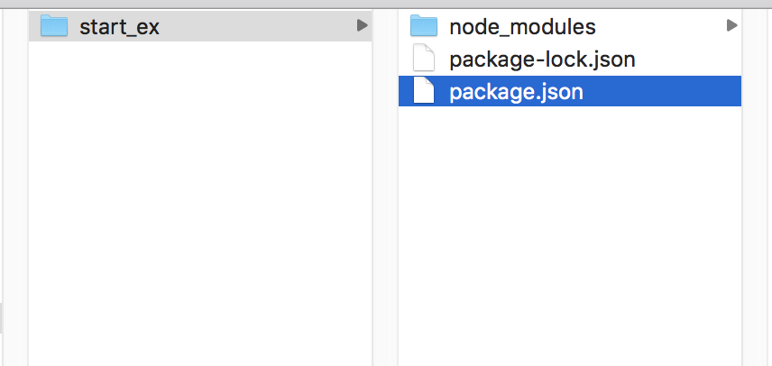

# node.js

JavaScriptをサーバーサイドで可動させてリアルタイム通信

&nbsp;
&nbsp;

## node.jsのインストール

[公式サイト](https://nodejs.org/)

node.jsのインストール/バージョン確認

```
node -v
//v10.15.1
```

&nbsp;
&nbsp;

## npm
Node.jsを使う上で必要となるパッケージを管理するツール。node.jsと同時にインストールされる

```
npm -v
//6.9.0
```

npmアップデートが必要な場合

```
npm update -g npm

```

&nbsp;
&nbsp;

## package.jsonの作成

```
npm init -y

```

&nbsp;
&nbsp;

## express

Node.jsを実行する環境フレームワーク

### express本体をインストール

terminalで任意のフォルダに移動。
express本体をインストール

```
npm install express --save
```



expressのバージョン確認

```
express --version
4.16.0
```

&nbsp;
&nbsp;


## Socket.io

通信用ライブラリ。リアルタイムアプリケーションを実現できる


[Socket.io](https://socket.io/)


socket.io モジュールのインストール

```
npm install --save socket.io

```


&nbsp;
&nbsp;


### 通信開始

サーバの起動

```
node index.js
```


`localhost:3000`　もしくは、`http://127.0.0.1:3000`でアクセスできる


サーバ終了は`ctr` + `c`

